<h1 align="center">
  <picture>
    <source media="(prefers-color-scheme: dark)" srcset="assets/logo/wordmark-dark.svg">
    
  </picture>
</h1>

<h3 align="center">Idea to merged PR, on autopilot.</h3>

<p align="center">
  <a href="https://github.com/easelyte/goodfellow/releases"></a>
  <a href="#install"></a>
  <a href="LICENSE"></a>
</p>

<p align="center">
  
</p>

**A Claude Code plugin that takes a change from idea to merged PR on autopilot, scaling the rigor to the risk.**

A one-line bug gets a failing test, the fix and a reviewed pull request. A new data model gets a
brainstorm, a spec and a plan, each reviewed by a second model before any code is written. A
migration also gets a rehearsal on a copy first. Either way it runs without stopping to ask, except
where a mistake would be public or irreversible.

## Install

Requires Claude Code, git and Python 3.10+. The [Codex CLI](https://github.com/openai/codex) is
optional; with it, a GPT model reviews alongside Claude.

```text
/plugin marketplace add easelyte/goodfellow
/plugin install goodfellow@goodfellow
```

<details>
<summary>Other ways to install</summary>

From your shell: `claude plugin marketplace add easelyte/goodfellow`, then
`claude plugin install goodfellow@goodfellow`. For one session from a checkout:
`claude --plugin-dir /path/to/goodfellow`. The marketplace tracks `main`;
`/plugin marketplace update goodfellow` pulls the latest.

</details>

## Quickstart

Fix a bug. goodfellow classifies it, writes a failing test, fixes it and ships:

```text
> /goodfellow:brainstorm "export --json drops quotes in names"
Tier T0 (fix): export --json writes invalid JSON when a name contains a quote.
Floor T0: nothing in the diff is on a high-stakes or live-state path.
```

Build something with a design decision in it. The same command goes the long way:

```text
> /goodfellow:brainstorm "Add per-workspace API keys"
Tier T2 (design): a new data model (API keys per workspace) with two reasonable designs.
Floor T1: src/auth/keys.py matches a high-stakes path.
```

It asks the questions that change the design, writes a spec, and hands off through review, plan,
execute and ship. Already have a diff? Run `/goodfellow:ship`. Ending a session, run
`/goodfellow:close` to keep what was learned.

## How depth adapts

| Tier | When | What runs |
|---|---|---|
| **T0**&nbsp;fix | Existing behaviour is wrong and reproducible | A failing test, the fix, ship |
| **T1**&nbsp;feature | A new, bounded, reversible behaviour | A short plan in the PR, test-first build, ship |
| **T2**&nbsp;design | A new concept or contract, unclear intent, or rival designs | Brainstorm, spec and plan, each reviewed, then build and ship |
| **T3**&nbsp;live | Migrations, deploys, credentials, deleting data, money, outside sends | Everything in T2, plus a rehearsal on a sandbox before the live step |

The tier changes the documents and how many review rounds are allowed. It never removes a check:
every tier gets a test that must fail first, a second-model review of the diff until no blocker or
major remains, a review of the final commit, and the stop list.

Override with `--tier T0..T3` (`ship --quick` is `--tier T0`). Paths you list as high-stakes force at
least T1, and live-state paths such as migrations force T3. Asking for less is refused, not ignored:

```text
> /goodfellow:ship --quick
Refused: --tier T0 is below the T1 floor. Floor T1: src/auth/session.py matches a high-stakes path.
```

## Features

- **Depth that fits the change.** A classify step picks the tier from a four-row rubric, announces
  it, and only ever raises it. Hard floors come from your own path lists.
- **Autopilot with a stop list.** No approvals between steps. A `PreToolUse` hook stops pushes and
  PRs to repos you don't own, default-branch pushes and PRs on public repos, releases, package
  publishes, migrations and force-pushes, and hands them to you.
- **Tests that must fail first.** `red_check.py` replays each new test against the base branch: it
  must fail there on an assertion, then pass. On high-stakes paths, a mutation check shows which
  changed lines no test would catch.
- **A second model reviews every diff.** With Codex installed, a GPT model reviews what Claude
  wrote, and a judge drops findings the code does not support. Reviews stop when findings drop to
  polish, not at a fixed count.
- **Knowledge that compounds.** Each run adds what it learned to `.goodfellow/knowledge.md`, and
  about 80 seeded design principles ship with the plugin. Deferred findings become tracked loops.

## When not to use it

- **You want to approve every step.** Set `GOODFELLOW_AUTOPILOT=0`, or use Claude Code on its own.
- **You don't use git or pull requests.** The chain ends in a PR.
- **One-off scripts and exploration.** Even T0 writes a test and runs a review. That is the point,
  and it is overhead you may not want.

Inspired by [obra/superpowers](https://github.com/obra/superpowers); goodfellow adds tiered depth,
cross-model review and hook-enforced stops.

## Skills

Invoke any skill as `/goodfellow:<name>`. The chain skills hand off to the next one on their own.

| Skill | What it does |
|---|---|
| **brainstorm** `[--grill] [--tier Tn] [--from-loop N]` | Classifies the change and does the design work its tier needs. `--grill` interviews you one question at a time. |
| **review-doc** `--spec \| --plan <path>` | Research, then rounds of two-reviewer adversarial review of a spec or plan. |
| **plan** `<spec>` | Task-by-task plan with dependencies and each test's expected red. |
| **execute** `<plan>` | Implements the plan test-first, verifying after each task. |
| **ship** `[--tier Tn \| --quick]` | Tier check, verification, red check, review to convergence, PR, merge. |
| **codex-review** | Direct review of the current diff, a file or a commit. |
| **triage** | Two independent reviewers per open loop, confirmed by you in one batch. |
| **public-pr** | Pre-open gate for PRs to public or upstream repos: internal-reference scrub and cross-fork mechanics. |
| **snap-compact**, **close** | Save learnings before compaction, and at the end of a session. |
| **branch**, **prune-stale** | Create a feature worktree; remove merged branches and old logs. |

`spec-review`, `plan-review` and `grill` still work as aliases through 0.4.x and are removed in 0.5.0.

<details>
<summary><b>Settings</b></summary>

Everything works without configuration. Invalid values fail loudly rather than falling back.

| Variable | Default | Purpose |
|---|---|---|
| `GOODFELLOW_AUTOPILOT` | on | `0` pauses for your approval at each step (the stop list stays on); `dry-run` logs decisions without changing files. |
| `GOODFELLOW_STOP_LIST` | on | `0` turns the stop list off, in every mode. Only for a session where you accept those risks yourself. |
| `GOODFELLOW_CODEX` | `1` | `0` disables Codex even when it is installed. |
| `GOODFELLOW_CODEX_MODEL` | Codex default | GPT model for the Codex reviewer. |
| `GOODFELLOW_REVIEW_MODEL` | `sonnet` / `opus` | Claude reviewer model (`opus` when it is the only reviewer). |
| `GOODFELLOW_HIGH_STAKES_PATHS` | `.goodfellow/high_stakes_paths.txt` | Globs that set a T1 floor and enable the mutation check. |
| `GOODFELLOW_LIVE_STATE_PATHS` | `.goodfellow/live_state_paths.txt` | Globs added to the built-in T3 list (migrations, service and timer units, crontabs, Terraform); `!glob` drops one. |
| `GOODFELLOW_GUARDS` | `1` | `0` turns off the built-in guards and the stop list. |
| `GOODFELLOW_MEMORY` | `flat` | Knowledge backend: `flat` (one file) or `rich` (one file per fact, indexed). |
| `GOODFELLOW_TAVILY_KEY` | unset | Tavily key for batch research; otherwise Claude's web search. |
| `GOODFELLOW_PRINCIPLES_WEB` | auto | `1` loads the JS, React, Next.js and Postgres principles; automatic with a `package.json`. |

**Stop list and guards** live in `.goodfellow/guards.json` (see
[the example](configs/guards.example.json)). `stop_list.owners` lists the owners you push to freely
(`owner` for GitHub, or `host/owner`; default: the owner of `origin`); `stop_list.migration_commands` replaces the migration list;
`disable_builtins` turns off a single stop such as `stop-migration`. Whether a repo is public is
looked up with `gh` and cached for ten minutes; if the lookup fails, the push or PR is stopped.
The same hook also blocks `git add -A`, force-pushes to `main` and
`--dangerously-skip-permissions`. `python3 scripts/guard_engine.py --selfcheck` prints what is
enforced. The full reference, including reviewers, memory backends and loops, is in
[docs/configuration.md](docs/configuration.md).

</details>

## FAQ

**Do I need Codex?** No. Without it a Claude reviewer takes its place and the review says so. You
lose the cross-family view that makes review most useful.

**What does it cost?** The plugin is free. Reviews are extra model calls on your Claude Code plan
and, if installed, your Codex plan. Lower tiers write fewer documents, so they cost less.

**Will it merge on its own?** Into your own private repo, yes, once review converges and CI is
green. On a public repo, opening the PR is on the stop list, so it hands that step to you.

**Where is its state?** In `.goodfellow/` at your project root: knowledge, loops, run logs and
guard rules. Commit what you want to share.

**Why the name?** A good fellow is a trusted companion: one who does the work and knows when to
stop and ask.

Pre-1.0: skill behaviour and file formats may still change between minor versions. The
[CHANGELOG](CHANGELOG.md) lists every change.

## Contributing

Issues and pull requests are welcome; start with [CONTRIBUTING.md](CONTRIBUTING.md). Tests run with
`cd scripts && python -m pytest -q`. Report security problems privately as described in
[SECURITY.md](SECURITY.md).

## License

[MIT](LICENSE) © 2026 easelyte.ai
