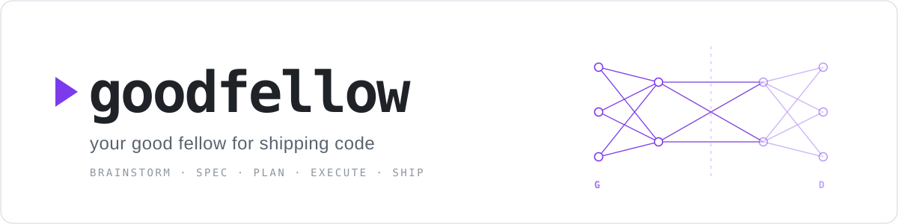
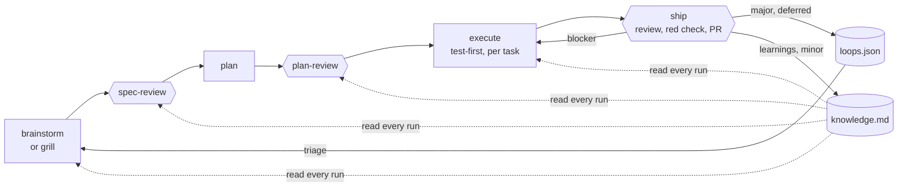
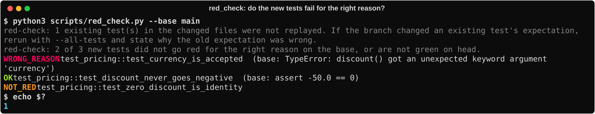

<p align="center">
  <picture>
    <source media="(prefers-color-scheme: dark)" srcset="docs/assets/goodfellow-hero-dark.svg">
    
  </picture>
</p>

<p align="center">
  <a href="https://github.com/easelyte/goodfellow/actions/workflows/ci.yml"></a>
  <a href="https://github.com/easelyte/goodfellow/releases"></a>
  <a href="LICENSE"></a>
  
  
</p>

<p align="center"><b>A Claude Code plugin that takes a change from idea to pull request with adversarial review at every step, and remembers what it learned for next time.</b></p>

Goodfellow gives Claude Code a development lifecycle: brainstorm, spec, plan, execute, ship. Each
stage is reviewed by a second model before the next one starts, review findings that are not fixed
become tracked follow-ups instead of disappearing, and every run adds to a knowledge file the next
run reads. It is for developers who already let Claude Code write real code and want the review,
testing and follow-through a careful team would apply, without doing all of it by hand.

It is a set of skills, hooks and small standard-library Python scripts. There is no server, no
account and no telemetry.

[Features](#features) ·
[Quickstart](#quickstart) ·
[How it works](#how-it-works) ·
[Skills](#skills) ·
[Configuration](#configuration) ·
[Principles](#principles) ·
[FAQ and limits](#faq-and-limits) ·
[Changelog](CHANGELOG.md)

## Features

- **Adversarial review at every stage.** Specs, plans and diffs are reviewed by Claude and, when the
  Codex CLI is installed, by a GPT model as well. Different model families miss different defects.
- **Review that stops for the right reason.** Rounds end when findings drop to polish, not at a fixed
  count. A verifier re-checks old findings before anyone fixes them, and a judge drops findings that
  do not hold up against the code.
- **Tests that can fail.** New tests must fail on the base branch on an assertion before they pass.
  `red_check.py` checks this automatically, and an optional mutation check shows which changed lines
  on high-stakes paths no test would catch.
- **Nothing slips.** Blockers stop the pull request. Major findings you defer are filed as loops in
  `.goodfellow/loops.json` and triaged later by two independent reviewers. Minor ones become
  knowledge gotchas.
- **Knowledge that compounds.** Each run appends what it learned to `.goodfellow/knowledge.md`, and
  the next brainstorm, review and plan read it. About 80 seeded design principles ship with the
  plugin, so a fresh install does not start empty.
- **Guards at the tool layer.** A `PreToolUse` hook blocks `git add -A`, force-pushes to `main` and
  `--dangerously-skip-permissions`, plus any rules your project declares. Unlike an instruction in a
  prompt, it still applies after context compaction.
- **Autopilot with an audit trail.** Run the chain hands-off, or in dry-run mode to see what it would
  do. Every decision is logged to `.goodfellow/runs/`.

## Quickstart

**You need** Claude Code, git, and Python 3.10 or newer. The [Codex CLI](https://github.com/openai/codex)
is optional but recommended; without it, reviews use a single Claude reviewer.

**1. Install** (inside Claude Code):

```text
/plugin marketplace add easelyte/goodfellow
/plugin install goodfellow@goodfellow
/reload-plugins
```

**2. Check it loaded:** type `/goodfellow:` and the skills are listed.

**3. Run the chain** on something small in a git repository:

```text
/goodfellow:brainstorm "Add a --json flag to the export command"
```

Goodfellow asks up to three questions (each with a recommended answer), writes a spec, and hands off
to `spec-review`, `plan`, `plan-review`, `execute` and `ship` in turn. You confirm at the points that
need a decision. At the end you have a pull request, and `.goodfellow/` holds what was learned and
anything deferred.

```text
/goodfellow:close        # end the session: persist learnings, check open loops
```

<details>
<summary>Other ways to install</summary>

From your shell, for scripting:

```bash
claude plugin marketplace add easelyte/goodfellow
claude plugin install goodfellow@goodfellow
```

In one command (Claude Code v2.1.275 or newer):

```text
/plugin install goodfellow --marketplace easelyte/goodfellow
```

For one session only, from a local checkout (nothing is registered):

```bash
claude --plugin-dir /path/to/goodfellow
```

`goodfellow@goodfellow` is `plugin@marketplace`: this repository is its own single-plugin marketplace
(`.claude-plugin/marketplace.json`), so installing does not depend on any plugin directory listing.
The marketplace tracks `main`; `/plugin marketplace update goodfellow` pulls the latest.

</details>

## How it works



Hexagons are review gates. Each gate runs rounds of two reviewers (a Claude subagent and the Codex
bridge, or Claude alone) until findings drop to polish:

1. **Research.** Factual claims the document depends on (library versions, API behaviour) are checked
   with a web search before review starts, so reviewers argue from facts.
2. **Review.** The two reviewers take different lenses: one checks testability and completeness, the
   other correctness, security and edge cases. On the Codex path a judge grounds or drops each
   finding against the code.
3. **Verify.** From round two, a verifier checks whether each finding is still real before it is
   fixed, which stops fix-find-fix loops.
4. **Route.** Blockers are fixed. Majors that are not fixed become loops. Minors become gotchas.

The design, review, plan and execute skills read the seeded principles and your knowledge file
before they work, and `ship`, `snap-compact` and `close` write back to it. Your fiftieth feature ships with what the first
forty-nine taught.

### Tests that can fail

A green suite of AI-written tests often proves little: tests that pass on their first run, go red
only because a function does not exist yet, grep the source instead of running it, or have their
expected value edited until they pass. Goodfellow asks for evidence that each new test can fail.

<p align="center">
  
</p>

- **In the prompts.** `plan` names each task's expected red (the assertion the new test fails with
  before the change). `execute` works test-first and never edits an expected value to match output.
  The reviewers look for source-grep tests, bent expectations and unpinned fail-open branches.
- **`red_check.py` (runs in `ship`).** Replays the branch's new tests against the base in a temporary
  worktree. Each must fail there on an assertion and pass on the branch. It reads JUnit XML, so any
  runner works; pytest is the default, others use `--test-cmd`.
- **`mutation_check.py` (opt-in).** List high-stakes paths in `.goodfellow/high_stakes_paths.txt`
  (see [the example](configs/high_stakes_paths.example.txt)) and `ship` mutates only the Python lines
  the branch changed there, in throwaway copies and under a time budget, and reports every mutant the
  tests miss. Running out of budget is reported as incomplete, never as a pass. Code that sends
  signals, spawns processes, or deletes or writes files is only mutated inside a private PID
  namespace (`--isolated`) or with fakes (`--fakes`), so a mutant cannot aim those calls at real
  resources.

## Skills

Invoke any skill as `/goodfellow:<name>`. The chain skills hand off to the next one automatically.

| Skill | What it does | Uses Codex |
|---|---|---|
| **brainstorm** `[--from-loop N]` | Explores the design with at most three questions, writes a spec. | No |
| **grill** `"<topic>"` | Opt-in, one-question-at-a-time interview for fuzzy or high-stakes intent. Ends when no decision is open. | No |
| **spec-review** `<path>` | Research, then multi-round adversarial review of a spec. | Optional |
| **plan** `<spec>` | Task-by-task plan with dependencies, acceptance criteria and each test's expected red. | No |
| **plan-review** `<path>` | Research, then multi-round adversarial review of a plan. | Optional |
| **execute** `<plan>` | Implements the plan test-first, verifying after each task. Can run independent tasks in parallel worktrees. | Optional |
| **ship** `[--quick]` | Verification, red check, adversarial diff review, PR, then learnings and follow-up loops. | Optional |
| **codex-review** | Direct review of the current diff, a file or a commit. | Optional |
| **triage** | Two independent reviewers per open loop, reconciled, confirmed by you in one batch. | Optional |
| **public-pr** | Pre-open gate for PRs to public or upstream repositories: internal-reference scrub, contributor checklist, cross-fork `gh pr create`. | No |
| **snap-compact** | Saves learnings and re-checks the guard set before context compaction. | No |
| **close** | Ends a session: commit check, promote learnings, stale-loop check, branch cleanup. | No |
| **branch** `<topic>` | Creates an isolated git worktree for feature work. | No |
| **prune-stale** | Removes merged branches, orphan worktrees and old logs. | No |

`brainstorm` is the default front end. Use `grill` when you are not sure what you want yet; it is
never picked automatically.

`execute` runs tasks one at a time by default. When a phase has about three or more tasks with no
dependency between them, it can fan them out to parallel implementers, each in its own git worktree,
and merge the results. Without runtime-enforced worktree isolation it stays serial.

## Configuration

Everything works without configuration. These environment variables change the defaults; invalid
values fail loudly rather than falling back.

| Variable | Default | Purpose |
|---|---|---|
| `GOODFELLOW_AUTOPILOT` | unset | `1` runs the chain hands-off; `dry-run` logs decisions without changing project files. |
| `GOODFELLOW_CODEX` | `1` | `0` disables Codex even when it is installed. |
| `GOODFELLOW_CODEX_MODEL` | Codex default | GPT model for the Codex reviewer. |
| `GOODFELLOW_REVIEW_MODEL` | see below | Claude reviewer model: `opus`, `sonnet` or `haiku`. |
| `GOODFELLOW_CODEX_STAGE_TIMEOUT` | `300` | Seconds per Codex stage. Generator and judge are two stages. |
| `GOODFELLOW_TRUST_ANALYZERS` | unset | `1` also runs `eslint`, `tsc` and `mypy` in the review pre-pass. These execute project config, so only for repositories you trust. |
| `GOODFELLOW_TAVILY_KEY` | unset | Tavily API key for batch research. Without it, research uses Claude's web search. |
| `GOODFELLOW_MEMORY` | `flat` | Knowledge backend: `flat` or `rich` (see below). |
| `GOODFELLOW_MEMORY_WARN_KB` | `16` | Rich mode: warn when the index exceeds this size. |
| `GOODFELLOW_PRINCIPLES_WEB` | auto | `1` loads the web principles (JS, React, Next.js, Postgres). Auto-enabled when a `package.json` is present. |
| `GOODFELLOW_HIGH_STAKES_PATHS` | `.goodfellow/high_stakes_paths.txt` | Glob list that enables the mutation check. |
| `GOODFELLOW_GUARDS` | `1` | `0` turns off the built-in guards. Project rules still apply. |
| `GOODFELLOW_TRIAGE_RETENTION_DAYS` | `90` | Days to keep closed triage entries. |
| `GOODFELLOW_RUNS_RETENTION_DAYS` | `90` | Days to keep autopilot run logs. |

<details>
<summary><b>Reviewers and models</b></summary>

With the Codex CLI installed, the bridge reviewer is Codex (generator plus judge), and
`spec-review` and `plan-review` add a parallel Claude reviewer (default `sonnet`). Without Codex, the
bridge falls back to a single Claude reviewer (default `opus`, so the only reviewer is not weaker than
the model that wrote the code). Setting `GOODFELLOW_REVIEW_MODEL` overrides both Claude reviewers; it
never reaches the Codex path.

A practical setup is Opus for your main session with Codex and Sonnet reviewing. Codex is worth
having mainly for cost: an adversarial pass from a different model family on every change, at little
marginal cost on a Codex subscription.

For `--commit` and `--base` reviews the bridge can prepend a static-analysis digest from `ruff`,
`shellcheck`, `gitleaks` (with the vendored [`configs/gitleaks.toml`](configs/gitleaks.toml)) and
`semgrep` (vendored local rules, never `--config auto`). Each is used if installed and skipped with
a note if not.

</details>

<details>
<summary><b>Tool-layer guards</b></summary>

A rule whose violation is expensive to undo should not live only in a prompt: compaction can drop it,
and the session that inherits the summary was never told. Goodfellow's `PreToolUse` hook
(`scripts/guard_engine.py`) checks every tool call instead.

Built in, on by default:

- `git add -A`, `git add .`, `git add --all`: stage specific files instead.
- `--dangerously-skip-permissions`.
- Force-push to a protected branch (`main` and `master` by default). Feature branches are not affected.

Matching is by shell token, and the built-ins only inspect `Bash` commands, so documenting a flag in a
file or a commit message does not trip a guard.

Add project rules in `.goodfellow/guards.json` (see
[`configs/guards.example.json`](configs/guards.example.json)):

```json
{
  "protected_branches": ["main", "master"],
  "block": [
    {
      "id": "no-prod-db-writes",
      "match": "regex",
      "pattern": "psql.*(prod|production)",
      "flags": "i",
      "reason": "Prod DB writes need a human.",
      "tools": ["Bash"],
      "bypass_env": "PROD_DB_OK"
    }
  ]
}
```

`python3 scripts/guard_engine.py --validate` checks a config (non-zero on error, for CI) and
`--selfcheck` prints what is enforced. A malformed config at runtime skips the project rules with a
warning but keeps the built-ins, so a typo cannot lock you out of fixing it. `CLAUDE_HOOK_BYPASS=1`
disables all guards for one command.

</details>

<details>
<summary><b>Knowledge and memory backends</b></summary>

**`flat` (default).** One append-only file, `.goodfellow/knowledge.md`, with three sections:

```markdown
## Principles
- 2026-06-02: Validate at the boundary, never trust upstream sanitization

## Patterns
- 2026-06-02: Stop reviewing when severity drops, not when the finding count hits zero

## Gotchas
- [pending] 2026-06-02: The Codex CLI has no --file flag; use --commit/--base/--uncommitted
```

`ship` and `snap-compact` add entries tagged `[pending]`; `close` confirms them.

**`rich` (`GOODFELLOW_MEMORY=rich`).** One file per fact under `.goodfellow/memory/`, a regenerated
index at `.goodfellow/MEMORY.md`, and per-domain registries. Writes are atomic, locked and journaled
(a two-phase write-ahead log with rollback), and the first rich write migrates an existing
`knowledge.md` without modifying it. Worth it when the flat file becomes unwieldy; most projects never
need it. Switching back to `flat` is safe.

</details>

<details>
<summary><b>Follow-up loops and triage</b></summary>

At ship time, deferred review findings are routed by severity:

- **Blocker** (security, data loss, correctness): stops the pull request until fixed or explicitly
  waived.
- **Major:** filed as a loop in `.goodfellow/loops.json` (priority `p1` to `p4`).
- **Minor:** added to the knowledge file as a gotcha.

```bash
python3 "${CLAUDE_PLUGIN_ROOT}/scripts/loop_store.py" list   # open loops
/goodfellow:brainstorm --from-loop 3                          # design a fix for loop 3
/goodfellow:triage                                            # sort real defects from noise
```

`triage` has two reviewers assess each loop independently, reconciles their verdicts, and asks you
to confirm in one table. Decisions go to `.goodfellow/triage-log.jsonl`. A loop can stay "unclear"
for at most three cycles. Findings from review round four onwards are filed at the lowest priority,
and a warning appears at 15 open loops.

</details>

<details>
<summary><b>Autopilot</b></summary>

`GOODFELLOW_AUTOPILOT=1` runs the chain without pausing; `dry-run` shows what it would do and writes
only the decision log (`.goodfellow/runs/<timestamp>-<pid>.jsonl`). Autopilot halts rather than
guesses when a self-review finding needs a human decision, and a spec can end the chain after review
with `next_action: halt-after-spec-review` in its frontmatter.

</details>

## Principles

Goodfellow is built on a few convictions:

- **A second model family finds what the first rationalised away.** Same-model review mostly repeats
  the author's blind spots.
- **Ground findings in facts.** Claims are researched before review, and findings are checked
  against the code before anyone fixes them.
- **Stop on severity, not on a round count.** And reaching a limit is not success: a cap, budget or
  timeout is reported as a halt, never as done.
- **A test is evidence only if it could have failed.** Red before green, for the right reason
  (P-094). Break the code on purpose to prove a test notices (P-095). Test behaviour through the real
  entry point, not the source text (P-096).
- **Constraints that matter belong in the tool layer**, not only in a prompt that compaction can
  drop.
- **Follow-ups need an owner.** A deferred finding is tracked and triaged, not noted and forgotten.
- **Knowledge should compound.** Every run leaves the next one better informed.

These convictions, and many more specific ones, ship as about 80 seeded principles in
[`knowledge/principles.md`](knowledge/principles.md) (stack-agnostic) and
[`knowledge/principles-web.md`](knowledge/principles-web.md) (JS, React, Next.js, Postgres). Each has a
stable `P-NNN` id that reviewers cite. They load in tiers: every run gets a short index of the
vital few plus a category table (about 720 tokens), and a skill pulls a category or a full principle
only when it is relevant. A CI ratchet keeps that index small; see
[`docs/instruction-density-budget.md`](docs/instruction-density-budget.md).

## FAQ and limits

**Do I need Codex?** No. Without it, reviews use one Claude reviewer (two in `spec-review` and
`plan-review`), and say so. You lose the cross-family diversity that makes review most useful.

**What does it cost?** Goodfellow itself is free. Each review round is extra model calls on your
Claude Code plan and, if installed, your Codex plan. `ship --quick` runs a single round for small
diffs.

**Does it change my code without asking?** Only inside the chain you started. `ship` opens a pull
request and asks once before merging it; only full autopilot merges on its own. Dry-run autopilot
writes nothing to your project but its decision log.

**Which languages?** The skills are language-agnostic. `red_check.py` works with any test runner that
writes JUnit XML. `mutation_check.py` mutates Python only.

**Where is its state?** In `.goodfellow/` at your project root: knowledge, loops, run logs, guard
rules. Commit what you want to share with your team.

**Known limits:**

- Best on macOS and Linux. On Windows `loops.json` is written without file locking, so do not run
  two sessions on one project at once.
- The rich-memory `SessionStart` hook does not fire for plugins installed from a git marketplace
  ([anthropics/claude-code#11509](https://github.com/anthropics/claude-code/issues/11509)). Recall
  does not depend on it: the chain skills read the index themselves.
- Some autopilot halts are planned but not yet wired: `confidence: low` in a spec, a verifier marking
  most findings stale, and open architectural questions.
- Pre-1.0: skill behaviour and file formats may still change between minor versions. The
  [CHANGELOG](CHANGELOG.md) lists every change.

## Contributing

Issues and pull requests are welcome. Start with [CONTRIBUTING.md](CONTRIBUTING.md); in short:

```bash
git clone https://github.com/easelyte/goodfellow.git
cd goodfellow/scripts && python -m pytest -q
```

Report security problems privately, as described in [SECURITY.md](SECURITY.md). Releases follow
[RELEASING.md](RELEASING.md).

## License

[MIT](LICENSE) © 2026 easelyte.ai
